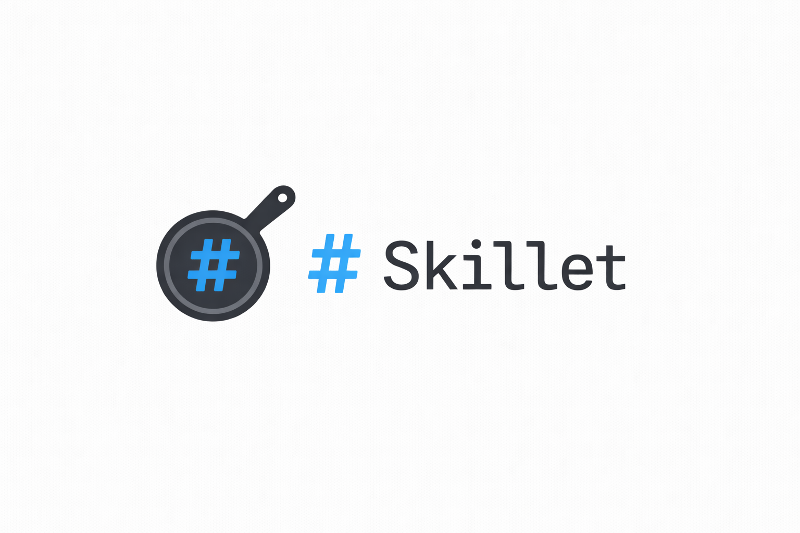

<p align="center">
  
</p>

<p align="center">
  <a href="https://github.com/joshrotenberg/skillet/actions/workflows/ci.yml"></a>
  <a href="https://crates.io/crates/skillet-mcp"></a>
  <a href="https://github.com/joshrotenberg/skillet/blob/main/Cargo.toml"></a>
</p>

# skillet

MCP-native skill discovery for AI agents.

## What is skillet

Skillet serves agent skills as MCP prompts. Your agent connects,
searches for skills relevant to the current task, and uses them
immediately via `prompts/get` -- no installation, no restart. It also
works as a CLI for browsing skills and managing repos.

Skills are just SKILL.md files in git repos. Anyone can create a
skill repo and share it. Skillet indexes them, runs full-text
search, and delivers them as MCP prompts at runtime. Think of it like
git: skillet is the tool, repos are distributed.

Skills follow the
[Agent Skills specification](https://docs.anthropic.com/en/docs/claude-code/skills)
and work with Claude Code, Cursor, Copilot, Windsurf, Gemini CLI, and
any compatible agent.

## Install

### Homebrew (macOS / Linux)

```bash
brew install joshrotenberg/brew/skillet-mcp
```

### Shell script

```bash
curl --proto '=https' --tlsv1.2 -LsSf https://github.com/joshrotenberg/skillet/releases/latest/download/skillet-mcp-installer.sh | sh
```

### Cargo

```bash
cargo install skillet-mcp
```

### Docker

```bash
docker pull ghcr.io/joshrotenberg/skillet:latest
docker run --rm -i ghcr.io/joshrotenberg/skillet:latest
```

Pre-built binaries for macOS, Linux, and Windows are also available on
the [releases page](https://github.com/joshrotenberg/skillet/releases).

## Quick start

### Give your agent access to skills (fastest)

Add skillet to your agent's MCP config and you're done -- your agent
can search for skills and use them as prompts at runtime:

```json
{
  "mcpServers": {
    "skillet": {
      "command": "skillet"
    }
  }
}
```

Or with Docker (zero install):

```json
{
  "mcpServers": {
    "skillet": {
      "command": "docker",
      "args": ["run", "-i", "--rm", "ghcr.io/joshrotenberg/skillet"]
    }
  }
}
```

That's it. Skillet auto-discovers skills from the
[official repo](https://github.com/joshrotenberg/skillet/tree/main/skills)
plus 14 community repos (Anthropic, Vercel, Firebase, Supabase, Google
Gemini, Microsoft, and more) via the [suggest graph](#decentralized-discovery-suggest-graph).
Your agent now has access to `search_skills` and the full
[MCP interface](#mcp-interface).

For custom or team repos, add `--remote` or `--repo` args:

```json
{
  "mcpServers": {
    "skillet": {
      "command": "skillet",
      "args": [
        "--repo", "/path/to/local-skills",
        "--remote", "https://github.com/acme/team-skills.git"
      ]
    }
  }
}
```

### Use the CLI

```bash
# Browse everything
skillet search '*'

# Search by keyword, category, tag, or owner
skillet search rust
skillet search '*' --category development
skillet search '*' --owner joshrotenberg

# See what categories exist
skillet categories

# Show details about a skill
skillet info joshrotenberg/rust-dev
```

### Embed skills in your project

Add skills directly to any repo -- no separate repo required:

```bash
# Generate a skillet.toml with an inline skill
skillet init --skill

# Write your skill prompt
$EDITOR SKILL.md

# That's it. Run skillet from this directory and the skill is served.
```

### Manage repos

```bash
# Add a remote skill repo
skillet repo add https://github.com/acme/team-skills.git

# Add a local skill directory
skillet repo add /path/to/local-skills

# See what's configured
skillet repo list

# Remove a repo
skillet repo remove https://github.com/acme/team-skills.git
```

### What it looks like

**Your agent, with skillet as an MCP server:**

```
User: Set up a new Rust project with CI

Agent: Let me search for relevant skills.
       [calls search_skills(query: "rust", category: "development")]

       Found joshrotenberg/rust-dev. Let me use its instructions.
       [calls prompts/get(name: "joshrotenberg_rust-dev")]

       I'll follow the rust-dev skill conventions for project setup...
```

**CLI:**

```
$ skillet search rust

  joshrotenberg/rust-dev    Rust development standards and conventions
  joshrotenberg/rust-ci     Rust CI/CD pipeline setup

Found 2 skills matching "rust"
```

## Features

### Skills as MCP prompts

Every skill in the index is registered as an MCP prompt, namespaced as
`owner_skill-name`. Agents discover skills via `prompts/list` and fetch
content via `prompts/get`. When the index refreshes, prompts are synced
automatically and a `prompts/list_changed` notification is emitted.

### Multi-repo support

Aggregate local directories and remote git repos. Skillet clones and
periodically refreshes remotes in the background. Use `--refresh-interval`
to control how often (default: every 5 minutes).

```bash
# CLI: explicit repos
skillet search rust \
  --repo /path/to/local \
  --remote https://github.com/acme/team-skills.git

# Or configure defaults in ~/.config/skillet/config.toml
```

### Decentralized discovery (suggest graph)

Repos can suggest other repos via `[[suggest]]` entries in their
`skillet.toml`. Skillet follows these on startup to build a discovery
graph -- no central authority needed. The official repo suggests 14
community and vendor repos (Anthropic, Vercel, Firebase, Supabase,
Google Gemini, Microsoft, Redis, Callstack, Kepano, TerminalSkills,
Softaworks, Anthony Fu, Daymade, and more) so you get broad coverage
out of the box.

```toml
# In any repo's skillet.toml
[[suggest]]
url = "https://github.com/acme/agent-skills.git"
description = "Acme team skills"
```

Skills discovered through the suggest graph are stamped with a hop-based
trust tier:

| Tier | Description |
|---|---|
| **Direct** | From a directly configured repo (depth 0) |
| **Suggested** | One hop away via a `[[suggest]]` link |
| **Transitive** | Two or more hops from a configured repo |

The suggest walker has configurable safety limits: max depth, max repos,
per-repo fan-out caps, clone timeout, URL allow/block lists, and negative
caching for failed URLs.

Opt out with `--no-suggest` or set `enabled = false` under `[suggest]`
in config.

### Release model resolution

Skillet respects release conventions when fetching repos:

1. **Consumer pin** (`[[source]]` in config.toml) -- highest priority.
   Lock a repo to a specific tag, branch, or commit.
2. **Author preference** (`[source]` in skillet.toml) -- the repo author
   declares `prefer = "release"`, `"main"`, or `"tag:v*"`.
3. **Auto-detect** -- if neither is set, skillet checks for a latest
   release tag; if none exists, it stays on the default branch.

```toml
# Consumer-side pin in ~/.config/skillet/config.toml
[[source]]
repo = "github.com/someone/skills"
version = "v2.1.0"
```

```toml
# Author-side preference in skillet.toml
[source]
prefer = "release"
```

### Project manifest (skillet.toml)

Embed skills directly in any repository with a `skillet.toml` at the
project root. No separate repo needed -- skillet auto-detects the
manifest and serves embedded skills alongside repo skills.

```toml
[project]
name = "my-tool"
description = "A CLI tool with agent skills"

[[project.authors]]
name = "Alice"
github = "alice"

# Single inline skill (SKILL.md at project root)
[skill]
name = "my-tool-usage"
description = "How to use my-tool"
```

Two layout modes:

- **Single skill** (`[skill]`): one SKILL.md at the project root
- **Multi-skill** (`[skills]`): a `.skillet/` directory with multiple skills

All sections are optional and can be combined. Scaffold one with:

```bash
skillet init --skill             # single skill
skillet init --multi             # multi-skill directory
```

### Zero-config skill discovery

Directories with only a `SKILL.md` are fully discoverable. YAML
frontmatter in SKILL.md is the primary metadata source:

```markdown
---
name: my-skill
description: What this skill does
version: 1.0.0
trigger: When to activate this skill
categories:
  - development
tags:
  - rust
  - testing
---

## My Skill

Instructions for the agent...
```

When frontmatter is absent, metadata is inferred automatically from the
directory name, git remote, and SKILL.md content. `skill.toml` is
supported as a legacy fallback but frontmatter is preferred.

### BM25 full-text search

Search indexes skill names, descriptions, categories, tags, and SKILL.md
content. Results are ranked by relevance using BM25 scoring with
field-weighted boosting.

### Persistent disk cache

The skill index is cached to disk and refreshed based on TTL (default: 5
minutes). The suggest graph has its own TTL (default: 1 hour). No
rebuilding from scratch every time. Use `--no-cache` to bypass.

### Filesystem watching

Use `--watch` with the MCP server to auto-reload when local repo
files change. Useful during skill development.

### Configurable server exposure

Control which MCP tools are exposed:

```bash
# Read-only mode
skillet --read-only

# Explicit allowlist
skillet --tools search,categories,info
```

## MCP interface

When running as an MCP server, agents discover skills via tools and
fetch skill content as prompts.

### Tools

| Tool | Purpose |
|---|---|
| `search_skills` | Full-text search with category, tag, and model filters |
| `list_categories` | Browse all skill categories with counts |
| `list_skills_by_owner` | List all skills by a specific publisher |
| `info_skill` | Detailed information about a specific skill |
| `annotate_skill` | Attach a persistent note to a skill |

### Prompts

Every indexed skill is served as an MCP prompt via `prompts/list` and
`prompts/get`. Prompt names are namespaced as `owner_skill-name` (e.g.
`joshrotenberg_rust-dev`). The prompt description comes from SKILL.md
frontmatter and the prompt content is the full SKILL.md text.

When the index refreshes (repo pull, filesystem watch, or cache
expiration), prompts are synced automatically: new skills are registered,
removed skills are unregistered, and a `prompts/list_changed` notification
is emitted to connected clients.

## CLI reference

### Use skills

| Command | Description |
|---|---|
| `skillet search <query>` | Search for skills (`*` for all). Supports `--category`, `--tag`, `--owner` |
| `skillet categories` | List all skill categories with counts |
| `skillet info <owner/name>` | Show detailed information about a skill |

### Author skills

| Command | Description |
|---|---|
| `skillet init [path]` | Generate a `skillet.toml` project manifest. Supports `--skill`, `--multi` |

### Manage repos

| Command | Description |
|---|---|
| `skillet repo add <url_or_path>` | Add a remote or local repo to config |
| `skillet repo remove <url_or_path>` | Remove a repo from config |
| `skillet repo list` | List configured repos |
| `skillet [serve]` | Run the MCP server (default when stdin is not a terminal) |

### Server options

| Flag | Description |
|---|---|
| `--repo <path>` | Local repo directory (repeatable) |
| `--remote <url>` | Git URL to clone and serve from (repeatable) |
| `--refresh-interval <duration>` | How often to pull from remotes (default: `5m`, `0` to disable) |
| `--cache-dir <path>` | Directory to clone remote repos into |
| `--subdir <path>` | Subdirectory within repos containing skills |
| `--watch` | Watch local repos for changes and auto-reload |
| `--http <addr>` | Serve over HTTP instead of stdio (e.g. `0.0.0.0:8080`) |
| `--read-only` | Expose only read-only tools |
| `--tools <list>` | Explicit tool allowlist (comma-separated) |
| `--no-suggest` | Don't follow `[[suggest]]` entries from repos |

**HTTP transport note**: `--http` disables origin validation to allow
connections from any origin. It is intended for local development and
trusted networks. In production, place behind a reverse proxy with
authentication and CORS configuration.

## Configuration

Skillet reads `~/.config/skillet/config.toml` for defaults. Create it
manually or use `skillet repo add` to populate repos:

```toml
[repos]
remote = ["https://github.com/joshrotenberg/skillet.git"]
local = []
follow_suggestions = true  # follow [[suggest]] entries from repos
suggest_depth = 1           # max recursion depth for suggestions

[cache]
enabled = true
ttl = "5m"              # index cache time-to-live
suggest_ttl = "1h"      # suggest graph cache TTL

[suggest]
enabled = true
max_depth = 2           # max BFS depth for suggest graph
max_per_repo = 5        # max suggestions per repo
max_repos = 20          # total max repos via suggestions
clone_timeout = "30s"
negative_cache_ttl = "1h"
allow = []              # URL glob allowlist (empty = allow all)
block = []              # URL glob blocklist

[server]
tools = []              # empty = expose all
resources = []          # empty = expose all

# Consumer-side version pinning
[[source]]
repo = "github.com/someone/skills"
version = "v2.1.0"
```

## Skill format

A skill is a directory with a `SKILL.md` file containing YAML
frontmatter for metadata and markdown content for the prompt:

```
owner/skill-name/
  SKILL.md         # Prompt with YAML frontmatter (required)
  scripts/         # Optional executable scripts
  references/      # Optional reference docs
  assets/          # Optional templates, configs
```

```markdown
---
name: rust-dev
description: Rust development standards and conventions
version: 2026.02.24
trigger: Use when writing or reviewing Rust code
license: MIT
author: Josh Rotenberg
categories:
  - development
  - rust
tags:
  - rust
  - cargo
  - clippy
  - fmt
  - testing
---

## Rust Development Standards

### Pre-commit Checklist
...
```

All frontmatter fields are optional -- skillet infers what it can from
the directory name, git remote, and content. Fully compatible with the
[Agent Skills specification](https://docs.anthropic.com/en/docs/claude-code/skills).

## Status

Skills are served as MCP prompts with YAML frontmatter as the primary
metadata source. The suggest graph discovers skills across 14 default
repos plus any you configure. Release model resolution respects author
preferences and consumer pins. The CLI covers search, info, categories,
init, and repo management.

See [open issues](https://github.com/joshrotenberg/skillet/issues) for
what's next.

## License

MIT OR Apache-2.0
